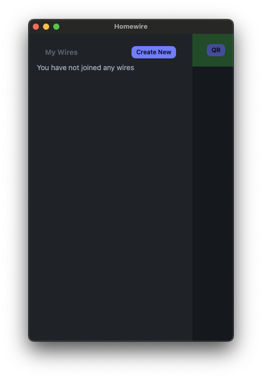

# Homewire Desktop
The desktop app for Homewire, the local-first P2P file and message sharing app.

> This is a work in progress

## Prerequisites
- Node.js
- NPM
- [Wails](https://wails.io/docs/gettingstarted/installation)
- [HomewireApp/homewire](https://github.com/HomewireApp/homewire)

## Development
### Installing Wails
This project uses the Wails project to run a native WebView app on the user's machine, and in order to build the source files properly you will need the Wails CLI installed on your machine.

Visit the [Wails installation page](https://wails.io/docs/gettingstarted/installation) for instructions on how to install it.

### Cloning the Homewire Core Library
To build the project you will also need the [HomewireApp/homewire](https://github.com/HomewireApp/homewire) core library cloned locally.

By default the project looks for this library at `../homewire`, so you should have a folder structure as follows:

```
- (where you place your projects)
  - homewire (cloned from https://github.com/HomewireApp/homewire)
  - homewire-desktop (this repo)
```

Once you have the `homewire` project make sure to build by going into its directory and running `go build`.

### Installing UI Dependencies
Once you have everything installed, go into the [frontend/](./frontend/) directory and install the UI dependencies to ensure the build process can run smoothly.

```bash
$ cd frontend
$ npm i
```

> Make sure to reinstall dependency whenever you change the dependencies in `package.json`

### Running in Development Mode
Now you're ready to build or run the app. To run it in dev mode which enables watch mode, go back to the project root and run:

```bash
$ wails dev
```

This will now open up the app.

## Building & Bundling
To bundle the app you can run the following command:

```bash
$ wails build
```

On MacOS this will build the application into an app package at [build/bin/Homewire.app](./build/bin/Homewire.app) which can be run as any regular MacOS app. If you'd like to build a basic binary instead, run the following command:

```bash
$ wails build -noPackage
```

In this case the output will be placed at [build/bin/homewire](./build/bin/homewire)

## Database Management
The Homewire core library uses a SQLite database to store information about nearby Homewires. By default this file is named `.homewire.db` and is placed under a folder named `.homewire` under the user's home directory.

On Windows the full path for this file is `%USERPROFILE%\.homewire\.homewire.db` and on UNIX systems it's `~/.homewire/.homewire.db`.

Feel free to open this file up in your favorite SQLite client, or simply delete it to create everything from scratch.

Remember, Wires that you delete this way can still be served by other apps in the network.

## Screenshots



## License
MIT
